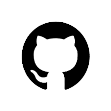

# 💫 About Me

Hi there! 👋\
Welcome to my GitHub!
<!-- The linting error in the following lines are because of the excessive lenght of the lines which is not allowed but I would like to keep the lines together! -->
I'm a passionate computer and data science enthusiast currently honing my skills in Python, backend development, and data analysis. I love solving problems, exploring new technologies, and continuously learning.

🌱 I’m currently learning data science to prepare for a career in this exciting field.\
🚀 My goal is to build projects that make a real-world impact, like soccer player injury prediction models or other sports analytics projects.\
🛠️ Tools & skills: Python, Golang, HTML, CSS, Excel, and more.\
⚽ Hobbies: I am a huge fun of soccer and I usually watch European soccer leagues in my free time. I also play indoor soccer for fun.\
📫 Feel free to reach out or connect! I’m always open to collaboration, learning, and sharing ideas.

## 🌐 Socials

## 💻 Tech Stack

## ✍️ Random Dev Quote

